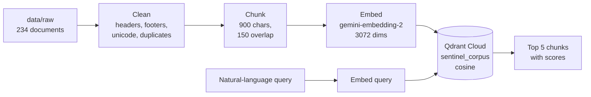

```mermaid
flowchart LR
    A[data/raw<br/>234 documents] --> B[Clean<br/>headers, footers,<br/>unicode, duplicates]
    B --> C[Chunk<br/>900 chars,<br/>150 overlap]
    C --> D[Embed<br/>gemini-embedding-2<br/>3072 dims]
    D --> E[(Qdrant Cloud<br/>sentinel_corpus<br/>cosine)]
    Q[Natural-language query] --> QE[Embed query] --> E
    E --> R[Top 5 chunks<br/>with scores]
```
